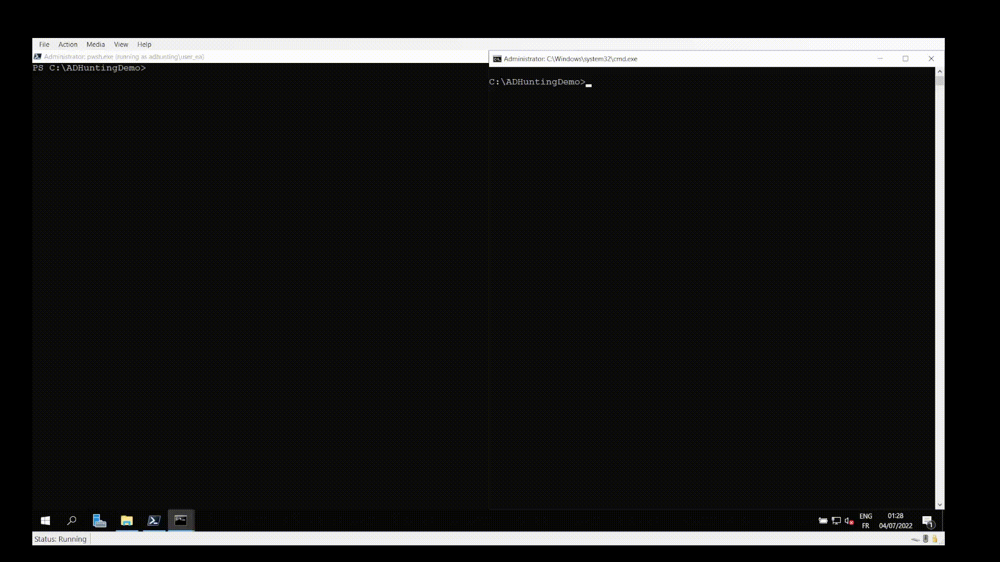
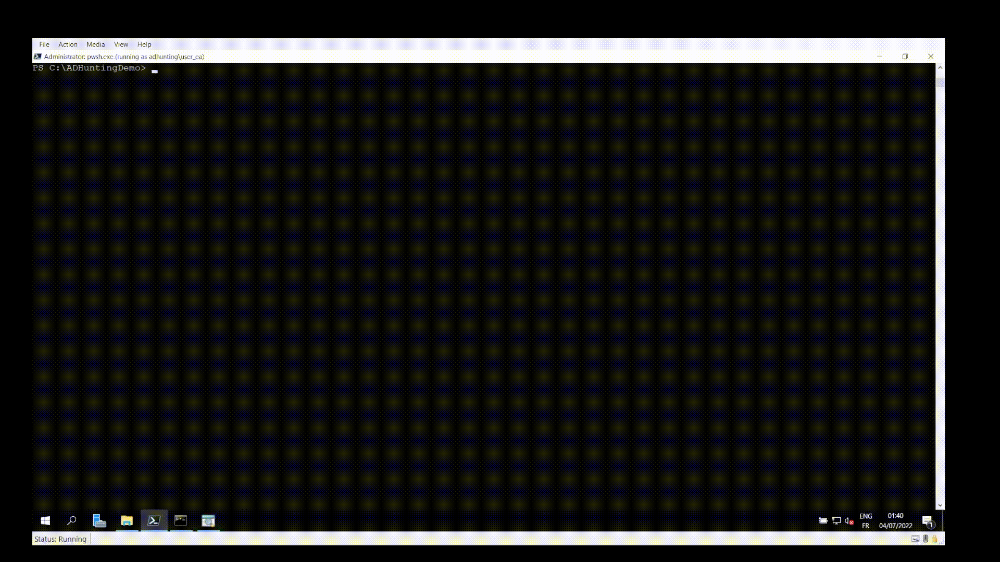

# FarsightAD

## Table of Contents

- [FarsightAD](#farsightad)
  - [Table of Contents](#table-of-contents)
  - [Description](#description)
  - [Prerequisite](#prerequisite)
  - [Basic usage](#basic-usage)
  - [AD Hunting cmdlets](#ad-hunting-cmdlets)
  - [Demo](#demo)
      - [Fully / partially hidden objects detection](#fully--partially-hidden-objects-detection)
  - [Acknowledgements](#acknowledgements)
  - [Thanks](#thanks)
  - [Author](#author)
  - [Licence](#licence)

## Description

`FarsightAD` is a PowerShell script that aim to help uncovering (eventual)
persistence mechanisms deployed by a threat actor following an Active
Directory domain compromise.

The script produces CSV / JSON file exports of various objects and their
attributes, enriched with timestamps from replication metadata. Additionally,
if executed with replication privileges, the
`Directory Replication Service (DRS)` protocol is leveraged to detect fully or
partially hidden objects.

For more information, refer to the
[SANS DFIR Summit 2022 introductory slides](XXX).

## Prerequisite

`FarsightAD` requires
[`PowerShell 7`](https://docs.microsoft.com/en-us/powershell/scripting/install/installing-powershell-on-windows)
and the `ActiveDirectory` module updated for `PowerShell 7`.

On Windows 10 / 11, the module can be installed through the `Optional Features`
as
[`RSAT: Active Directory Domain Services and Lightweight Directory Services Tools`](https://docs.microsoft.com/en-us/troubleshoot/windows-server/system-management-components/remote-server-administration-tools). Already installed module can be updated with:

```
Add-WindowsCapability -Online -Name Rsat.ServerManager.Tools~~~~0.0.1.0
```

If the module is correctly updated, `Get-Command Get-ADObject` should return:

```
CommandType     Name                                               Version    Source
-----------     ----                                               -------    ------
Cmdlet          Get-ADObject                                       1.0.X.X    ActiveDirectory
```

## Basic usage

```
. .\FarsightAD.ps1

Invoke-ADHunting [-Server <DC_IP | DC_HOSTNAME>] [-Credential <PS_CREDENTIAL>] [-ADDriveName <AD_DRIVE_NAME>] [-OutputFolder <OUTPUT_FOLDER>] [-ExportType <CSV | JSON>]
```

## AD Hunting cmdlets

| Cmdlet | Synopsis |
|--------|----------|
| `Invoke-ADHunting` | Execute all the FarsightAD AD hunting cmdlets (mentionned below). |
| `Export-ADHuntingACLDangerousAccessRights` | Export dangerous ACEs, i.e ACE that allow takeover of the underlying object, on all the domain's objects. <br><br> May take a while on larger domain. |
| `Export-ADHuntingACLDefaultFromSchema` | Export the ACL configured in the defaultSecurityDescriptor attribute of Schema classes. <br><br> Non-default (as defined in the Microsoft documentation) ACLs are identified and potentially dangerous ACEs are highlighted. |
| `Export-ADHuntingACLPrivilegedObjects` | Export the ACL configured on the privileged objects in the domain and highlight potentially dangerous access rights. |
| `Export-ADHuntingADCSCertificateTemplates` | Export information and access rights on certificate templates. <br><br> The following notable parameters are retrieved: certificate template publish status, certificate usage, if the subject is constructed from user-supplied data, and access control (enrollment / modification). |
| `Export-ADHuntingADCSPKSObjects` | Export information and access rights on sensitive PKS objects (NTAuthCertificates, certificationAuthority, and pKIEnrollmentService). |
| `Export-ADHuntingGPOObjectsAndFilesACL` | Export ACL access rights information on GPO objects and files, highlighting GPOs are applied on privileged users or computers. |
| `Export-ADHuntingGPOSettings` | Export information on various settings configured by GPOs that could be leveraged for persistence (privileges and logon rights, restricted groups membership, scheduled and immediate tasks V1 / V2, machine and user logon / logoff scripts). |
| `Export-ADHuntingHiddenObjectsWithDRSRepData` | Export the objects' attributes that are accessible through replication (with the Directory Replication Service (DRS) protocol) but not by direct query. <br><br> Access control are not taken into account for replication operations, which allows to identify access control blocking access to specific objects attribute(s). <br><br> Only a limited set of sensitive attributes are assessed. |
| `Export-ADHuntingKerberosDelegations` | Export the Kerberos delegations that are considered dangerous (unconstrained, constrained to a privileged service, or resources-based constrained on a privileged service). |
| `Export-ADHuntingPrincipalsAddedViaMachineAccountQuota` | Export the computers that were added to the domain by non-privileged principals (using the ms-DS-MachineAccountQuota mechanism). |
| `Export-ADHuntingPrincipalsCertificates` | Export parsed accounts' certificate(s) (for accounts having a non empty userCertificate attribute). <br><br> The certificates are parsed to retrieve a number of parameters: certificate validity timestamps, certificate purpose, certificate subject and eventual SubjectAltName(s), ... |
| `Export-ADHuntingPrincipalsDontRequirePreAuth` | Export the accounts that do not require Kerberos pre-authentication. |
| `Export-ADHuntingPrincipalsOncePrivileged` | Export the accounts that were once member of privileged groups. |
| `Export-ADHuntingPrincipalsPrimaryGroupID` | Export the accounts that have a non default primaryGroupID attribute, highlighting RID linked to privileged groups. |
| `Export-ADHuntingPrincipalsPrivilegedAccounts` | Export detailed information about members of privileged groups. |
| `Export-ADHuntingPrincipalsPrivilegedGroupsMembership` | Export privileged groups' current and past members, retrieved using replication metadata. |
| `Export-ADHuntingPrincipalsSIDHistory` | Export the accounts that have a non-empty SID History attribute, with resolution of the associated domain and highlighting of privileged SIDs. |
| `Export-ADHuntingPrincipalsShadowCredentials` | Export parsed Key Credentials information (of accounts having a non-empty msDS-KeyCredentialLink attribute). |
| `Export-ADHuntingPrincipalsTechnicalPrivileged` | Export the technical privileged accounts (SERVER_TRUST_ACCOUNT and INTERDOMAIN_TRUST_ACCOUNT). |
| `Export-ADHuntingPrincipalsUPNandAltSecID` | Export the accounts that define a UserPrincipalName or AltSecurityIdentities attribute, highlighting potential anomalies. |
| `Export-ADHuntingTrusts` | Export the trusts of all the domains in the forest. <br><br> A number of parameters are retrieved for each trust: transivity, SID filtering, TGT delegation. |

More information on each cmdlet usage can be retrieved using `Get-Help -Full <CMDLET>`.

## Demo

#### Fully / partially hidden objects detection


<p align="center"><em>Adding a fully hidden user</em></p>


<p align="center"><em>Hiding the SID History attribute of an user</em></p>


<p align="center"><em>Uncovering the fully and partially hidden users with Export-ADHuntingHiddenObjectsWithDRSRepData</em></p>

## Acknowledgements

  - The `C#` code for `DRS` requests was adapted from:
    - [`MakeMeEnterpriseAdmin`](https://github.com/vletoux/MakeMeEnterpriseAdmin)
      by @vletoux.
    - [`Mimikatz`](https://github.com/gentilkiwi/mimikatz) by @gentilkiwi and
      @vletoux.
    - [`SharpKatz`](https://github.com/b4rtik/SharpKatz) by @b4rtik.

  - The functions to parse Key Credentials are from the
    [`ADComputerKeys PowerShell module`](https://www.powershellgallery.com/packages/ADComputerKeys/1.0.0/Content/ADComputerKeys.psm1).

  - The AD CS related persistence is based on work from:
    - [Certified Pre-Owned](https://posts.specterops.io/certified-pre-owned-d95910965cd2)
      by Will Schroeder (@harmj0y) and Lee Christensen (@tifkin_)
    - [Microsoft ADCS – Abusing PKI in Active Directory Environment](https://www.riskinsight-wavestone.com/en/2021/06/microsoft-adcs-abusing-pki-in-active-directory-environment/)
      by Jean Marsault (@iansus)

  - The function to parse Service Principal Name is based
    [on work from Adam Bertram](https://github.com/adbertram/Random-PowerShell-Work/blob/master/ActiveDirectory/ActiveDirectorySPN.psm1).

## Thanks

  - Antoine Cauchois (@caucho_a) for the proofreading, testing and ideas.

## Author

[Thomas DIOT (Qazeer)](https://twitter.com/_Qazeer)

## Licence

CC BY 4.0 licence - https://creativecommons.org/licenses/by/4.0/
